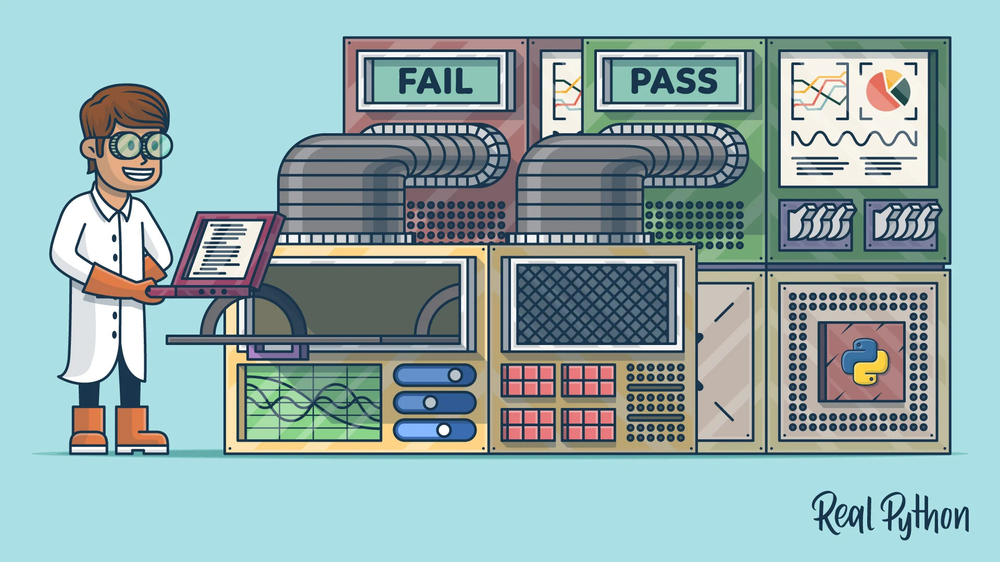

# :white_check_mark: PYTHON CLEAN TESTS :white_check_mark:

This simple repository is an example on how to develop Python-based projects with clean architecture approaches. It will cover multiple examples and environments so that it replicates a real-life scenario for Python developments.

  

 

These projects are inspired by:

- [Corey Schafer](https://www.youtube.com/channel/UCCezIgC97PvUuR4_gbFUs5g), thanks for the free amazing tutorials, they are amazing!
- [Real Python](https://realpython.com/python-testing/), I am grateful for having such an amazing documentation and examples!
- All the amazing open-source contributors that make it possible to create these amazing Python functionalities!

 

The information of this repository is based on many online tutorials, so feel free to use it as a guide for your future projects, enjoy!. 

## Dependencies :vertical_traffic_light:

The dependencies are explained in detail for each project, but the most important one is Python (regardless your operating system).

 

### Software dependencies (based on project)

- [Visual Studio Code](https://code.visualstudio.com/)  
  Visual Studio Code is my main code editor for high-level programming. This is not absolutely necessary, but from my experience, it gives us a great performance and we can link it with Git and GitHub easily.  

- [Python](https://www.python.org/)  
  Python is an amazing dynamic programming language that lets us work fast, with easy and powerful integration of different software solutions.  

### Libraries and Package dependencies (based on project)

- [UnitTest](https://docs.python.org/3/library/unittest.html)  
  This unit testing framework was originally inspired by JUnit and has most functionalities of major unit testing frameworks. It allows us to test code in an object-oriented approach.  

- [PyTest](https://docs.pytest.org/en/7.0.x/)  
  This is a framework that enables the creation of easy readable tests and can scale up to handle more complex functionalities for applications and libraries.  

## Usage :art:

All sample-projects are well commented and most of them have specifications and remarks for their purpose and I/O (search for additional README.md files).  

## Author :musical_keyboard:

### Santiago Garcia Arango.
